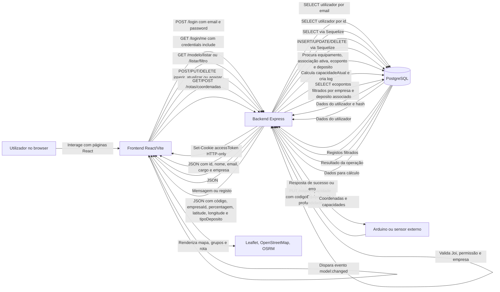
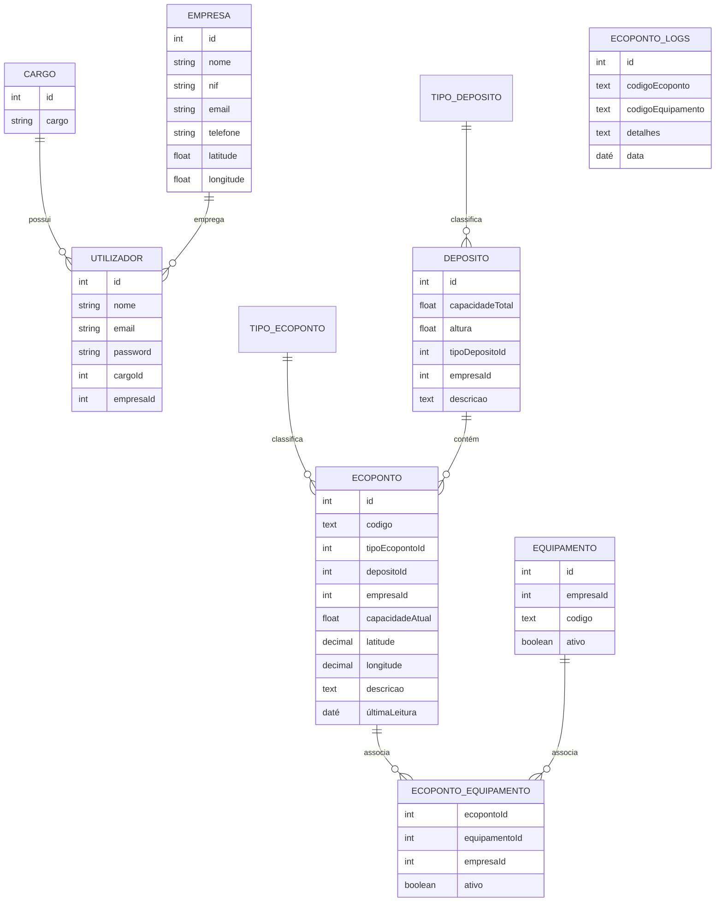

# EcoSensor

## 1. Introdução

O EcoSensor e uma aplicação web desenvolvida para apoiar a monitorização e a gestão operacional de ecopontos. O sistema permite registar empresas, utilizadores, ecopontos, depósitos, equipamentos de medição e associações entre ecopontos e equipamentos. A finalidade principal e acompanhar a capacidade ocupada dos ecopontos, guardar logs de leituras e disponibilizar um mapa operacional capaz de apoiar a decisão sobre que ecopontos devem ser recolhidos.

O projeto integra uma vertente de Internet of Things, uma vez que o backend possui um endpoint preparado para receber leituras de um equipamento externo, como um Arduino com sensor de profundidade. A leitura enviada pelo equipamento permite calcular a ocupação do deposito associado ao ecoponto, atualizar a capacidade atual e criar um registo histórico em logs.

A aplicação está dividida em duas camadas principais:

- Backend em Node.js, Express, Sequelize e PostgreSQL, responsável por autenticação, autorização, validação, persistência de dados, regras de empresa e cálculo das leituras recebidas.
- Frontend em React e Vite, responsável pela interface gráfica, backoffice, dashboard, listagens, formulários, filtros, mapa interativo e criação visual de rotas.

As principais ferramentas utilizadas são React, Vite, Express, Sequelize, PostgreSQL, Leaflet, React-Leaflet, JSON Web Tokens, bcrypt, Joi e cookies HTTP-only. Em conjunto, estas ferramentas permitem construir uma aplicação web com separação entre frontend e backend, autenticação baseada em sessão por cookie, filtragem por empresa e interface geográfica para apoio a rotas.

## 2. Documentação Técnica

### 2.1 Arquitetura geral

O EcoSensor segue uma arquitetura cliente-servidor:

- O frontend corre no browser e comunica com a API através de `fetch`.
- O backend expõe endpoints HTTP organizados por recursos.
- A base de dados PostgreSQL armazena entidades de negocio e registos históricos.
- O mapa utiliza OpenStreetMap como camada visual, Nominatim para pesquisa de localizações e OSRM, através de `leaflet-routing-machine`, para desenhar rotas.

### 2.2 Backend

As versões abaixo correspondem as versões instaladas no `package-lock.json` do pacote raiz.

| Framework ou biblioteca | Função no projeto |
| --- | --- |
| Express 5.2.1 | Framework HTTP usada para criar a API, registar rotas e montar middlewares. |
| Sequelize 6.37.8 | ORM usado para definir modelos, associações e queries sobre PostgreSQL. |
| pg 8.20.0 | Driver PostgreSQL utilizado pelo Sequelize para comunicar com a base de dados. |
| pg-hstore 2.3.4 | Dependência complementar frequentemente usada com Sequelize/PostgreSQL. |
| bcrypt 6.0.0 | Gera hashes de palavras-passe e valida credenciais no login. |
| jsonwebtoken 9.0.3 | Cria e valida tokens JWT usados na sessão autenticada. |
| cookie-parser 1.4.7 | Permite ao Express ler cookies recebidos, incluindo o cookie `accessToken`. |
| cors 2.8.6 | Configura acesso entre frontend e backend, incluindo cookies com `credentials`. |
| dotenv 17.4.2 | Carrega variáveis de ambiente, como dados da base de dados e segredo JWT. |
| Joi 18.2.1 | Valida payloads de criação e atualização antes de estes chegarem a base de dados. |
| OpenAI 6.37.0 | Usado no ficheiro auxiliar `documentation.js` para gerar documentacao/changelog, não no fluxo principal da aplicação. |
| axios 1.17.0 | Dependência instalada no pacote raiz; no código principal atual não e a biblioteca usada para as chamadas da API. |
| universal-cookie 8.1.2 | Dependência instalada no pacote raiz; a sessão atual e gerida por cookies HTTP-only no backend, não por leitura direta no frontend. |
| lucide-react 1.18.0 | Dependência também presente no frontend; no backend não tem função operacional. |
| tailwindcss 4.3.1 | Dependência instalada; o estilo atual e maioritariamente CSS manual em `frontend/src/index.css`. |
| gulp 5.0.1 | Dependência de desenvolvimento instalada, sem papel direto no arranque atual da API. |
| gulp-concat 2.6.1 | Dependência de desenvolvimento associada ao ecossistema Gulp. |

### 2.3 Frontend

As versões abaixo correspondem as versões instaladas no `frontend/package-lock.json`.

| Framework ou biblioteca | Função no projeto |
| --- | --- |
| React 19.2.6 | Biblioteca principal para construção da interface, componentes, estado e ciclo de vida. |
| React DOM 19.2.6 | Faz a montagem da aplicação React no elemento `#root` do HTML. |
| Vite 8.0.13 | Servidor de desenvolvimento e ferramenta de build do frontend. |
| @vitejs/plugin-react 6.0.2 | Plugin que permite ao Vite processar React. |
| Leaflet 1.9.4 | Biblioteca base de mapas usada para marcadores, popups, tiles e interação geográfica. |
| React-Leaflet 5.0.0 | Integração de Leaflet com React através de componentes como `MapContainer`, `Marker` e `Popup`. |
| leaflet-routing-machine 3.2.12 | Desenhá rotas no mapa usando OSRM. |
| react-select 5.10.2 | Select boxes pesquisáveis e limpas usadas nos filtros e formulários. |
| lucide-react 1.18.0 | Iconografia da aplicação, incluindo botões, menu, mapa, dashboard e marcadores. |
| react-icons 5.6.0 | Biblioteca instalada, sem utilização direta observada nos componentes atuais. |
| bcrypt 6.0.0 | Dependência instalada no frontend, mas o hashing real de passwords e executado no backend. |
| @tailwindcss/vite 4.3.0 | Plugin instalado, mas não configurado no `vite.config.js` atual. |
| @tailwindcss/postcss 4.3.0 | Dependência de suporte Tailwind/PostCSS instalada. |
| tailwindcss 4.3.1 | Instalado, embora o design atual esteja implementado com CSS customizado. |
| postcss 8.5.15 | Ferramenta de transformação CSS. |
| autoprefixer 10.5.0 | Adiciona prefixos CSS quando usado em pipeline PostCSS. |
| ESLint 10.3.0 | Ferramenta de análise estática para qualidade do código frontend. |
| eslint-plugin-react-hooks 7.1.1 | Regras ESLint específicas para hooks React. |
| eslint-plugin-react-refresh 0.5.2 | Regras relacionadas com React Refresh em desenvolvimento. |
| globals 17.6.0 | Lista de variáveis globais usadas pela configuração ESLint. |
| @types/react 19.2.14 | Tipos TypeScript para React, mesmo que o projeto esteja em JavaScript. |
| @types/react-dom 19.2.3 | Tipos TypeScript para React DOM. |

### 2.4 Configuração do Vite e acesso pela rede

O ficheiro `frontend/vite.config.js` contém:

```js
export default defineConfig({
  server: {
    host: '0.0.0.0',
    port: 5173
  },
  plugins: [react()],
})
```

Esta configuração faz com que o servidor de desenvolvimento do Vite escute em `0.0.0.0`, isto e, em todas as interfaces de rede da máquina. Assim, além de estar disponível em `http://localhost:5173`, o frontend pode ser acedido por outros dispositivos da mesma rede usando o IP local da máquina, por exemplo `http://192.168.x.x:5173`.

Para que esse acesso funcione com a API, o backend também escuta em `0.0.0.0` e o CORS aceita:

- `http://localhost:5173`
- o valor definido em `FRONTEND_URL`

No frontend, a variável `VITE_API_URL` define o endereço do backend. Se não existir, o frontend usa `http://localhost:3000`.

### 2.5 Variáveis de ambiente

O backend usa as seguintes variáveis:

| Variável | Função |
| --- | --- |
| `PORT` | Porta do backend. Se não for definida, usa `3000`. |
| `FRONTEND_URL` | Origem adicional permitida pelo CORS. |
| `DB_NAME` | Nome da base de dados PostgreSQL. |
| `DB_USER` | Utilizador da base de dados. |
| `DB_PASSWORD` | Password da base de dados. |
| `DB_HOST` | Host da base de dados. |
| `DB_PORT` | Porta da base de dados. Se não for definida, usa `5432`. |
| `JWT_SECRET` | Segredo usado para assinar e validar JWTs. |
| `OPENAI_API_KEY` | Usada apenas no script auxiliar `documentation.js`. |

O frontend usa:

| Variável | Função |
| --- | --- |
| `VITE_API_URL` | URL base da API, por exemplo `http://10.103.25.61:3000`. |

## 3. Fluxo de Informação

### 3.1 Fluxo geral da aplicação



### 3.2 Interpretação do fluxo

O frontend nunca acede diretamente a base de dados. Todas as operações passam pelo backend, que concentra as regras de autenticação, autorização, validação e separação por empresa. O frontend envia pedidos com `credentials: include`, permitindo que o cookie HTTP-only sejá enviado automaticamente para o backend.

O backend devolve sempre dados em JSON quando a resposta e estruturada. Nas operações de escrita, varias rotas devolvem mensagens simples como "Registro criado com sucesso"; algumas, como a criação de ecoponto, devolvem o próprio registo criado.

O módulo `/rotas` tem duas responsabilidades distintas:

- `PUT /rotas/capacidade`: recebe leituras externas de equipamentos, como Arduino, atualiza o ecoponto e cria logs.
- `GET/POST /rotas/coordenadas`: fornece ao frontend os pontos necessários para o mapa e para a rota, respeitando a empresa do utilizador autenticado.

## 4. Estrutura do Projeto

```text
EcoSensor/
├── backend/
│   ├── app.js
│   ├── db.js
│   ├── script.js
│   ├── functions/
│   ├── middleware/
│   ├── models/
│   └── routes/
├── frontend/
│   ├── vite.config.js
│   ├── src/
│   │   ├── App.jsx
│   │   ├── Login.jsx
│   │   ├── mapa.jsx
│   │   ├── routing.jsx
│   │   ├── context/
│   │   ├── middleware/
│   │   └── backoffice/
│   └── public/
├── documentation.js
├── package.json
└── README.md
```

O backend contém a API e os modelos da base de dados. O frontend contém a interface gráfica. O ficheiro `documentation.js` e um script auxiliar que usa OpenAI para gerar changelog/documentação, mas não faz parte do fluxo principal da aplicação.

## 5. Base de Dados, Modelos e Relações

### 5.1 Relações principais



### 5.2 Modelos

| Modelo | Tabela | Campos principais | Função |
| --- | --- | --- | --- |
| `Cargo` | `cargo` | `id`, `cargo` | Define o nível de permissão: super administrador, administrador ou funcionário. |
| `Utilizador` | `utilizador` | `nome`, `email`, `password`, `cargoId`, `empresaId` | Representa quem entra na aplicação. A password e guardada como hash bcrypt. |
| `Empresa` | `empresa` | `nome`, `nif`, `email`, `telefone`, `latitude`, `longitude` | Representa a entidade responsável por ecopontos, equipamentos e utilizadores. As coordenadas são usadas como sede no mapa. |
| `TipoEcoponto` | `tipo_ecoponto` | `tipo`, `descricao` | Classifica o ecoponto, por exemplo verde, amarelo ou azul. |
| `TipoDeposito` | `tipo_deposito` | `tipo`, `descricao` | Classifica o deposito, por exemplo superficie ou subterraneo. |
| `Deposito` | `deposito` | `capacidadeTotal`, `altura`, `tipoDepositoId`, `empresaId`, `descricao` | Define as caracteristicas físicas que permitem calcular a ocupação do ecoponto. |
| `Ecoponto` | `ecoponto` | `codigo`, `tipoEcopontoId`, `depositoId`, `empresaId`, `capacidadeAtual`, `latitude`, `longitude`, `últimaLeitura` | Representa o ponto geográfico monitorizado e o estado atual da sua ocupação. |
| `Equipamento` | `equipamento` | `empresaId`, `codigo`, `ativo` | Representa o sensor/equipamento que envia leituras para o backend. |
| `EcopontoEquipamento` | `ecoponto_equipamento` | `ecopontoId`, `equipamentoId`, `empresaId`, `ativo` | Tabela de associação entre ecoponto e equipamento. Permite identificar que equipamento mede que ecoponto. |
| `EcopontoLogs` | `ecoponto_logs` | `codigoEcoponto`, `codigoEquipamento`, `detalhes`, `data` | Guarda histórico de leituras, erros e eventos associados aos equipamentos/ecopontos. |

### 5.3 Associações Sequelize

As associações são declaradas em `backend/models/models.js`:

- `Cargo.hasMany(Utilizador)` e `Utilizador.belongsTo(Cargo)`.
- `Empresa.hasMany(Utilizador)` e `Utilizador.belongsTo(Empresa)`.
- `TipoEcoponto.hasMany(Ecoponto)` e `Ecoponto.belongsTo(TipoEcoponto)`.
- `TipoDeposito.hasMany(Deposito)` e `Deposito.belongsTo(TipoDeposito)`.
- `Deposito.hasMany(Ecoponto)` e `Ecoponto.belongsTo(Deposito)`.
- `Ecoponto.belongsToMany(Equipamento)` através de `EcopontoEquipamento`.
- `Equipamento.belongsToMany(Ecoponto)` através de `EcopontoEquipamento`.

## 6. Segurança, Autenticação e Separacao por Empresas

### 6.1 Login

O login e feito em `POST /login`.

1. O frontend envia `email` e `password`.
2. O backend procura o utilizador por email.
3. Se existir, compara a password recebida com o hash guardado usando `bcrypt.compare`.
4. Se a password estiver correta, cria um JWT com o `id` do utilizador.
5. O token e guardado num cookie chamado `accessToken`.

Configuração do cookie:

| Propriedade | Valor |
| --- | --- |
| `httpOnly` | `true`, impedindo acesso por JavaScript no browser. |
| `secure` | `false`, adequado a desenvolvimento HTTP local. |
| `sameSite` | `lax`, reduzindo risco de envio em contextos externos. |
| `maxAge` | 1 hora. |

O frontend não le o token diretamente. Em vez disso, usa `credentials: "include"` em todos os pedidos e chama `GET /login/me` para confirmar se existe sessão valida.

### 6.2 Obtenção do utilizador logado no frontend

O contexto `AuthContext` executa `checkAuth()` ao iniciar a aplicação. Este metodo chama `/login/me`; se o cookie for valido, o backend devolve:

```json
{
  "id": 1,
  "nome": "Super Admin",
  "email": "teste@gmail.com",
  "cargo": 1,
  "empresa": null
}
```

O objeto e guardado em `authUser`, permitindo que `App.jsx`, `Sidebar.jsx`, `Dashboard.jsx`, formulários e mapa adaptem o comportamento ao cargo do utilizador.

### 6.3 Middlewares de segurança

| Middleware | Função |
| --- | --- |
| `autenticarJWT` | Le o cookie `accessToken`, valida o JWT com `JWT_SECRET` e coloca o payload em `req.user`. |
| `carregarUtilizador` | Vai a base de dados buscar o utilizador real, substitui `req.user` por `id`, `cargo`, `empresaId` e `superAdmin`. |
| `autorizarAcessoBackoffice` | Permite apenas cargos 1 e 2. |
| `autorizarAcessoSuperAdmin` | Permite apenas utilizadores com `cargoId === 1`. |
| `validarBody` | Recebe um schema Joi, valida `req.body`, converte tipos quando possível e rejeita dados inválidos. |

### 6.4 Cargos

| Cargo | Valor | Permissões principais |
| --- | --- | --- |
| Super Administrador | `cargoId = 1` | Ve todas as empresas e todos os dados. Pode escolher empresa no mapa, criar/editar entidades globais e gerir cargos/tipos com maior alcance. |
| Administrador | `cargoId = 2` | Acede ao backoffice, mas os dados são filtrados pela sua empresa. |
| Funcionário | `cargoId = 3` | Não acede ao backoffice; e encaminhado para a página do mapa. |

### 6.5 Separacao por empresa

A separação de dados no backend e feita sobretudo com duas funções auxiliares:

```js
whereEmpresa(req, extraWhere = {})
setEmpresaId(req)
```

`whereEmpresa` devolve:

- `{ ...extraWhere }` para super admin.
- `{ ...extraWhere, empresaId: req.user.empresaId }` para administradores normais.

`setEmpresaId` devolve:

- `req.body.empresaId` para super admin.
- `req.user.empresaId` para administradores normais.

Isto impede que um administrador normal crie ou edite registos noutra empresa, mesmo que tente manipular o payload enviado pelo frontend.

### 6.6 Exceções e casos particulares

- Em `Deposito`, a listagem permite a administradores ver depósitos da sua empresa e depósitos globais com `empresaId = null`.
- Em `Empresa`, a listagem normal devolve todas as empresas para super admin e apenas a própria empresa para administradores normais.
- Em `EcopontoLogs`, como a tabela não possui `empresaId`, a filtragem e feita através dos códigos de ecopontos e equipamentos pertencentes a empresa do utilizador. O super admin ve todos os logs.
- No frontend, o menu de `Empresas`, `Tipo Ecopontos` e `Tipo Depositos` aparece apenas ao super admin, embora a decisão final de segurança deva ser sempre considerada a do backend.

## 7. Endpoints da API

### 7.1 Endpoints de autenticação

| Método e rota | Função |
| --- | --- |
| `POST /login` | Autentica email/password, cria JWT e envia cookie `accessToken`. |
| `GET /login/me` | Valida o cookie e devolve o utilizador logado. |
| `POST /login/logout` | Limpa o cookie `accessToken`. |

### 7.2 Endpoints não específicos a modelos CRUD

| Método e rota | Função | Observações |
| --- | --- | --- |
| `GET /` | Executa `inserirDados()` e responde `"online"`. | Endpoint de desenvolvimento. Usa `sequelize.sync({ force: true })`, logo recria tabelas e dados iniciais. |
| `PUT /rotas/capacidade` | Recebe `codigoEquipamento` e `profundidade`, atualiza capacidade do ecoponto e cria logs. | Usado para integração com Arduino/sensor externo. |
| `GET /rotas/coordenadas` | Devolve ecopontos com coordenadas e percentagem para o mapa. | Autenticado; aplica empresa do utilizador. |
| `POST /rotas/coordenadas` | Igual ao anterior, mas permite ao super admin enviar `empresaId` no body. | Usado pelo mapa para escolher empresa. |

### 7.3 Modelos, rotas e middlewares específicos

| Modelo | Rota base | Rotas principais | Middleware específico | Filtros suportados |
| --- | --- | --- | --- | --- |
| `Cargo` | `/cargo` | `POST /inserir`, `PUT /atualizar/:id`, `DELETE /apagar/:id`, `GET /listar` | Autenticação, `carregarUtilizador`, backoffice; escrita exige super admin. | Listagem filtra cargos superiores ao cargo atual para admin normal. |
| `Empresa` | `/empresa` | `POST /inserir`, `PUT /atualizar/:id`, `DELETE /apagar/:id`, `GET /listar`, `GET /listar/filtro` | Autenticação, `carregarUtilizador`, Joi `empresa` nas escritas. | `nome`, `nif`, `email`, `telefone`. |
| `Utilizador` | `/utilizador` | `POST /inserir`, `PUT /atualizar/:id`, `DELETE /apagar/:id`, `GET /listar`, `GET /listar/filtro` | Autenticação, backoffice, Joi `utilizador`, bcrypt para password. | `nome`, `email`, `cargoId`, `empresaId`. |
| `TipoEcoponto` | `/tipoecoponto` | `POST /inserir`, `PUT /atualizar/:id`, `DELETE /apagar/:id`, `GET /listar`, `GET /listar/filtro` | Autenticação, backoffice; escrita exige super admin; Joi `tipoEcoponto`. | `tipo`, `descricao`. |
| `TipoDeposito` | `/tipodeposito` | `POST /inserir`, `PUT /atualizar/:id`, `DELETE /apagar/:id`, `GET /listar` | Autenticação, backoffice, Joi `tipoDeposito`. | A rota backend atual não implementa `/listar/filtro`, embora o frontend tenha estrutura de filtros. |
| `Deposito` | `/deposito` | `POST /inserir`, `PUT /atualizar/:id`, `DELETE /apagar/:id`, `GET /listar`, `GET /listar/filtro` | Autenticação, backoffice, Joi `deposito`, `setEmpresaId`, `whereEmpresa`. | `tipoDepositoId`, `descricao`, `capacidadeTotalMin`, `capacidadeTotalMax`, `alturaMin`, `alturaMax`. |
| `Ecoponto` | `/ecoponto` | `POST /inserir`, `PUT /atualizar/:id`, `DELETE /apagar/:id`, `GET /listar`, `GET /listar/filtro` | Autenticação, backoffice, Joi `ecoponto`, `setEmpresaId`, `whereEmpresa`. | `codigo`, `tipoEcopontoId`, `depositoId`, `empresaId`, `descricao`, `capacidadeAtualMin`, `capacidadeAtualMax`, `capacidadeTotalMin`, `capacidadeTotalMax`. |
| `Equipamento` | `/equipamento` | `POST /inserir`, `PUT /atualizar/:id`, `DELETE /apagar/:id`, `GET /listar`, `GET /listar/filtro`, `GET /total` | Autenticação, backoffice, `setEmpresaId`, `whereEmpresa`. | `codigo`, `ativo`. |
| `EcopontoEquipamento` | `/ecopontoequipamento` | `POST /inserir`, `PUT /atualizar/:idEcoponto/:idEquipamento`, `DELETE /apagar/:idEcoponto/:idEquipamento`, `GET /listar`, `GET /listar/filtro` | Autenticação, backoffice, Joi `ecopontoEquipamento`, `setEmpresaId`, `whereEmpresa`. | `ecopontoId`, `equipamentoId`, `ativo`. |
| `EcopontoLogs` | `/ecopontologs` | `POST /inserir`, `DELETE /apagar/:id`, `GET /listar`, `GET /listar/filtro` | Autenticação, backoffice, filtro lógico por empresa através de códigos de ecoponto/equipamento. | `codigoEcoponto`, `codigoEquipamento`, `detalhes`, `dataInicio`, `dataFim`. |

## 8. Lógica do Arduino e Calculo da Capacidade

O fluxo de leitura externa está em `backend/routes/getTabela.js`, na rota `PUT /rotas/capacidade`.

O Arduino ou equipamento envia:

```json
{
  "codigoEquipamento": "ARD001",
  "profundidade": 50
}
```

O backend executa a seguinte sequência:

1. Procura o equipamento por `codigoEquipamento`.
2. Se não existir, cria log de erro.
3. Procura uma associação ativa em `EcopontoEquipamento`.
4. Se não existir associação ativa, cria log de erro.
5. Procura o ecoponto associado.
6. Procura o deposito associado ao ecoponto.
7. Converte a profundidade de centímetros para metros.
8. Se a medição for superior a altura do deposito, atualiza a capacidade para `0` e cria log de erro.
9. Calcula a percentagem ocupada com base na profundidade e altura.
10. Calcula a capacidade atual ocupada.
11. Atualiza `capacidadeAtual` e `últimaLeitura` do ecoponto.
12. Cria um log com equipamento, medição, ecoponto, ocupação e percentagem.

Este processo liga diretamente a camada física do sensor ao sistema de gestão. A partir do momento em que a base de dados e atualizada, o frontend pode obter os dados atualizados através de `/rotas/coordenadas`, `/ecoponto/listar` ou `/ecopontologs/listar`.

## 9. Frontend e Navegação

### 9.1 Entrada da aplicação

O ficheiro `frontend/src/main.jsx` monta a aplicação:

- Importa `index.css`.
- Envolve `App` em `AuthProvider`.
- Renderiza dentro de `#root`.

O `AuthProvider` e essencial porque toda a aplicação depende de saber se existe utilizador logado e qual o seu cargo.

### 9.2 `App.jsx`

`App.jsx` controla a navegação principal sem usar uma biblioteca externa de routing. O estado local define:

| Estado | Função |
| --- | --- |
| `view` | Determina se o conteúdo atual e `dashboard`, `map` ou `backoffice`. |
| `page` | Determina a página concreta dentro do backoffice. |
| `selectedItem` | Guarda o item selecionado para editar ou apagar. |
| `ecopontoMapCoordinates` | Guarda coordenadas vindas do mapa para criar/editar ecopontos. |
| `empresaMapCoordinates` | Guarda coordenadas vindas do mapa para criar/editar empresas. |
| `mobileSidebarOpen` | Controla abertura da sidebar em mobile. |

Depois do login:

- Super admin e admin entram no dashboard.
- Funcionário entra diretamente no mapa.

Se um funcionário tentar navegar para páginas de backoffice, o próprio `navigate()` força a voltar ao mapa.

### 9.3 Tipos de página por cargo

| Cargo | Experiência no frontend |
| --- | --- |
| Super admin | Acede ao dashboard, mapa, empresas, tipos, depósitos, ecopontos, equipamentos, associações, logs e utilizadores. |
| Admin | Acede ao dashboard, mapa, depósitos, ecopontos, equipamentos, associações, logs e utilizadores, com dados limitados pela empresa. |
| Funcionário | Ve apenas o mapa, sem sidebar de backoffice. |

### 9.4 Sidebar

A sidebar usa `lucide-react` para ícones e contém as entradas:

- Dashboard
- Mapa
- Tipo Ecopontos
- Tipo Depositos
- Empresas
- Depositos
- Ecopontos
- Equipamentos
- Ecoponto Equip.
- Logs Ecopontos
- Utilizadores

Algumas entradas tem `adminOnly: true`, que neste ficheiro significa visibilidade exclusiva para super admin (`cargo === 1`).

### 9.5 Backoffice

O backoffice está centralizado em `frontend/src/backoffice/Backoffice.jsx`. Este ficheiro contém uma lista de secções, onde cada seccao define:

- página base;
- página de adicionar;
- página de editar;
- página de apagar;
- componente de listagem;
- formulário de criação/edição;
- componente de eliminação.

Quando a página e apenas uma listagem, o backoffice mostra um painel único. Quando a página e de adicionar, editar ou apagar, mostra uma grelha com:

- lista a esquerda;
- formulário ou confirmação a direita.

Isto permite editar dados sem perder o contexto da listagem.

## 10. Componentes Visuais e Design Gráfico

### 10.1 Linguagem visual

O design está concentrado em `frontend/src/index.css`. A interface usa:

- tema escuro;
- verdes como cor principal, associados ao tema ambiental;
- azul para ações de mapa/rota;
- vermelho para ações destrutivas;
- cantos arredondados discretos;
- cartões, tabelas e painéis com bordas;
- ícones lucide em botões e navegação.

Variáveis CSS como `--bg`, `--surface`, `--border`, `--text`, `--muted`, `--green` e `--danger` garantem consistência visual.

### 10.2 Elementos principais

| Elemento | Função |
| --- | --- |
| Header | Mostra marca EcoSensor, utilizador logado e botão de logout. |
| Sidebar | Permite navegar entre dashboard, mapa e módulos de backoffice. |
| Dashboard cards | Mostram metricas como total de ecopontos, média de enchimento e total de empresas. |
| Tabelas | Apresentam registos dos modelos com colunas configuradas por página. |
| Botoes de icone | Editar e apagar registos nas tabelas. |
| Botoes primarios | Criar registos, aplicar filtros, submeter formulários. |
| Botoes destrutivos | Apagar registos e terminar sessão. |
| Filtros | Permitem limitar listagens antes de fazer novo pedido ao backend. |
| Select boxes | Permitem escolher opções vindas de outros endpoints. |
| Range sliders | Permitem filtrar intervalos numéricos de capacidade e altura. |
| Popups de mapa | Mostram ecopontos agrupados, percentagens e botão para adicionar ecoponto. |
| Tooltips de mapa | Mostram percentagem de enchimento junto aos marcadores. |

### 10.3 `ListTemplate`

`ListTemplate` e o componente reutilizável para listagens. Recebe:

- título;
- texto do botão de adicionar;
- estado de loading;
- erro;
- items;
- colunas;
- função para chave da linha;
- handlers de editar/apagar;
- seção de filtros;
- funções para aplicar e limpar filtros.

Quando existem filtros, mostra uma zona própria com icone, campos, botão "Aplicar filtros" e botão "Limpar filtros". As tabelas tem scroll horizontal quando necessario.

### 10.4 `FormTemplate`

`FormTemplate` normaliza formulários de criação e edição. Mostra:

- título automático;
- estado de novo registo ou editar registo;
- botão cancelar;
- botão de submit;
- mensagens de sucesso ou erro.

Cada formulário específico injeta os seus campos dentro deste templaté.

### 10.5 Select boxes

As select boxes são criadas com `react-select`. As opções não são estáticas; são obtidas com hooks que chamam endpoints reais:

- ecopontos usam `useEcopontos`;
- depósitos usam `useDepositos`;
- tipos usam `useTipoEcopontos` ou `useTipoDepositos`;
- equipamentos usam `useEquipamentos`;
- empresas usam `useEmpresas`;
- cargos usam `useCargos`.

Como os hooks chamam o backend, as opções já respeitam os filtros de empresa aplicados nas rotas. Assim, um administrador normal tende a ver apenas opções da sua empresa.

### 10.6 `RangeSliderFilter`

`RangeSliderFilter` e usado para filtros numéricos com mínimo e máximo. O componente:

- converte valores para numero;
- impede que o mínimo ultrapasse o máximo;
- impede que o máximo fique abaixo do mínimo;
- calcula percentagens para pintar visualmente o intervalo selecionado;
- ajusta o `step`: valores superiores a 20 usam passo 1, valores menores usam 0.1;
- mostra limites e valores atuais.

Nas páginas:

- `Ecopontos` usa range para capacidade ocupada e capacidade total.
- `Depositos` usa range para capacidade total e altura.

## 11. Funções Auxiliares do Frontend

### 11.1 `middleware/request.js`

Centraliza chamadas HTTP:

- usa `VITE_API_URL` ou `http://localhost:3000`;
- envia sempre `credentials: "include"`;
- serializa payload JSON;
- interpreta respostas JSON ou texto;
- extrai mensagens de erro de `erro` ou `error`;
- após `POST`, `PUT`, `PATCH` ou `DELETE`, dispara evento `model:changed`.

O evento `model:changed` permite que listagens e mapa sejam atualizados automaticamente após alterações.

### 11.2 `middleware/use.js`

Define o hook genérico `useModel(modelName, filters)`.

O hook:

1. Chama `/${modelName}/listar` quando não há filtros.
2. Chama `/${modelName}/listar/filtro?...` quando existem filtros.
3. Guarda dados, loading e erro.
4. Expõe `refetch`.
5. Escuta `model:changed` e volta a carregar quando o modelo alterado coincide com `modelName`.

Os hooks específicos (`useEcopontos`, `useEquipamentos`, etc.) são pequenos wrappers sobre este hook genérico.

### 11.3 `middleware/coordinatesHelper.js`

Contém:

- `getDistance(a, b)`: calcula distância em metros entre coordenadas usando a fórmula de Haversine.
- `formatCoordinates(pontos, tolerance = 5)`: remove pontos duplicados ou muito próximos e converte coordenadas para formato `lat,lng|lat,lng`, usado no Google Maps.

### 11.4 `middleware/options.js`

Guarda opções reutilizáveis para operadores numéricos e estado ativo/inativo. No código atual, algumas páginas definem opções localmente, mas este ficheiro fica preparado para reutilização.

## 12. Dashboard

O dashboard agrega informação operacional:

- total de ecopontos;
- média de enchimento;
- gráfico de ecopontos por nível de enchimento: `<50%`, `50% - 70%`, `>70%`;
- para super admin, total de empresas;
- para super admin, gráfico de ecopontos por empresa;
- última leitura/log;
- botão para abrir o mapa.

A média de enchimento e calculada usando `capacidadeAtual / capacidadeTotal * 100`, procurando a capacidade total através do deposito associado.

Para administradores normais, a última leitura e escolhida entre logs cujos códigos pertencem aos ecopontos ou equipamentos da empresa. Para super admin, e usado o log mais recente devolvido pelo backend.

## 13. Mapa e Roteamento

O ficheiro `frontend/src/mapa.jsx` e um dos elementos centrais do projeto, porque liga dados operacionais, geografia, empresas, ecopontos, filtros e rotas.

### 13.1 Bibliotecas usadas no mapa

| Biblioteca | Função no mapa |
| --- | --- |
| `leaflet` | Base cartográfica, ícones, marcadores, popups e controlo do mapa. |
| `react-leaflet` | Componentes React para usar Leaflet. |
| `leaflet-routing-machine` | Cria a linha da rota no mapa. |
| OpenStreetMap | Fornece os tiles visuais do mapa. |
| Nominatim | Permite pesquisar localizações por texto. |
| OSRM | Calcula a geometria da rota usada pelo `leaflet-routing-machine`. |
| Google Maps | E aberto externamente com destino e waypoints quando o utilizador escolhe abrir a rota. |

### 13.2 Estados principais do mapa

| Estado | Função |
| --- | --- |
| `pontos` | Ecopontos recebidos do backend por `/rotas/coordenadas`. |
| `selectedDepositoType` | Tipo de deposito usado na rota: `superficie` ou `subterraneo`. |
| `selectedEmpresaId` | Empresa escolhida pelo super admin. |
| `routeActive` | Indica se a rota Leaflet já foi ativada. |
| `routeRefreshKey` | Forca recálculo visual da rota quando os pontos mudam. |

### 13.3 Obtenção dos pontos

O mapa usa `fetchPontos()`:

- Se o utilizador e super admin e ainda não existe empresa selecionada, limpa os pontos.
- Se e super admin, chama `POST /rotas/coordenadas` com `{ empresaId }`.
- Se não e super admin, chama `GET /rotas/coordenadas`.

No backend, `whereEmpresa(req)` garante que:

- super admin pode pedir uma empresa específica;
- admin normal recebe apenas ecopontos da sua empresa.

### 13.4 Empresas no mapa

O mapa também usa `useEmpresas()` para carregar empresas. Depois filtra apenas empresas com latitude e longitude válidas.

Para super admin:

- todas as empresas com coordenadas podem aparecer;
- clicar numa empresa altera `selectedEmpresaId`;
- a empresa selecionada fica com icone destacado;
- a empresa selecionada define a sede/destino da rota.

Para admin normal:

- a lista de empresas recebida pelo backend tende a conter apenas a sua empresa;
- o utilizador não altera a empresa por clique como o super admin.

### 13.5 Grupos de ecopontos

O mapa agrupa ecopontos muito próximos usando `groupNearbyEcopontos`.

A tolerância e:

```js
const ECOPONTO_GROUP_TOLERANCE_METERS = 5;
```

Isto significa que ecopontos até 5 metros de distância são representados como um grupo. A função:

1. Percorre todos os pontos.
2. Valida coordenadas.
3. Procura grupo existente com algum ecoponto dentro da tolerância.
4. Se encontrar, adiciona o ecoponto ao grupo.
5. Se não encontrar, cria novo grupo.
6. Escolhe como representante do grupo o ecoponto com maior percentagem.

O marcador do grupo usa as coordenadas do representante. O popup lista todos os ecopontos do grupo e as respetivas percentagens.

Esta estratégia evita sobreposição visual de marcadores quando existem ecopontos fisicamente muito próximos, por exemplo ecopontos de diferentes tipos colocados no mesmo local.

### 13.6 Filtro de rota por tipo de deposito

No topo do mapa existe um controlo segmentado com:

- Superficial
- Subterraneo

O mapa filtra os ecopontos de acordo com `tipoDeposito`. O texto e normalizado para evitar problemas com acentos e maiusculas.

Para cada grupo:

1. São considerados apenas ecopontos do tipo selecionado.
2. Dentro desse subconjunto, e escolhido o ecoponto mais cheio.
3. O ponto só entra na rota se a percentagem for superior a 70%.

Assim, a rota prioriza ecopontos com maior necessidade de recolha e ignora ecopontos com ocupação igual ou inferior a 70%.

### 13.7 Criação da rota

A rota e criada em duas fases:

1. Ao clicar em "Calcular rota", `routeActive` passa para `true` e o componente `Routing` e montado.
2. O componente `Routing` recebe `pontosRota`, converte coordenadas para `L.latLng` e cria um `L.Routing.control`.

`pontosRota` e composto por:

- ecopontos cheios filtrados;
- empresa selecionada, usada como sede/destino.

O `Routing` usa:

```js
L.Routing.osrmv1({
  serviceUrl: "https://router.project-osrm.org/route/v1",
})
```

As instruções textuais da rota são escondidas por CSS, ficando apenas a linha visual no mapa.

Se a rota já estiver ativa, o botão muda para "Abrir Google Maps". Ao clicar, abre:

```text
https://www.google.com/maps/dir/?api=1&destination=<sede>&waypoints=<ecopontos>
```

As coordenadas dos waypoints são formatadas por `formatCoordinates`, que também remove pontos duplicados num raio de 5 metros.

### 13.8 Pesquisa no mapa

`MapSearchControl` permite pesquisar uma localizacao por texto. O componente:

- recebe o texto do utilizador;
- chama Nominatim com `format=json` e `limit=1`;
- se encontrar resultado, centra o mapa na coordenada encontrada;
- impede propagacao de eventos para não interferir com o arrastar/clicar do mapa.

### 13.9 Escolha de coordenadas em formulários

O mesmo `Mapa` e usado dentro dos formulários de ecoponto e empresa.

Quando `canPickEcopontoCoordinates` ou `canPickEmpresaCoordinates` está ativo:

- o clique no mapa e capturado por `MapClickPicker`;
- as coordenadas são formatadas com 7 casas decimais;
- o formulário recebe latitude e longitude;
- e apresentado um marcador de "Local selecionado".

Isto permite escolher coordenadas visualmente, em vez de obrigar o utilizador a escrever valores manualmente.

### 13.10 Marcadores e elementos gráficos do mapa

| Marcador | Icone | Significado |
| --- | --- | --- |
| Ecoponto superficial | `Recycle` | Grupo/ecoponto de deposito de superficie. |
| Ecoponto subterraneo | `Database` | Grupo/ecoponto subterraneo. |
| Empresa selecionada | `Building2` em marcador verde/claro | Empresa usada como sede/destino. |
| Empresa não selecionada | `Building2` em marcador vermelho | Empresa disponível para selecao pelo super admin. |
| Coordenada selecionada | `MapPin` ou `Building2` | Ponto escolhido dentro de formulário. |

Os tooltips permanentes mostram a percentagem de enchimento do representante do grupo.

## 14. Responsividade

O frontend foi desenhado para funcionar em desktop e mobile.

Principais adaptações:

- A sidebar passa a menu lateral sobreposto abaixo dos 900 px.
- Surge botão de abrir/fechar menu no header.
- Em mobile, header reorganiza o utilizador e botões.
- Grelhas do dashboard passam para uma coluna.
- Backoffice deixa de usar duas colunas fixas e passa a empilhar lista/formulário.
- Tabelas mantem largura mínima e usam scroll.
- Controlos do mapa mudam de posição e largura para caber em ecras pequenos.
- Filtros passam de grelha multi-coluna para coluna unica.

Estas regras estão em média queries para `1180px`, `900px`, `640px` e `390px`.

## 15. Como as Paginas Chamam Endpoints

### 15.1 Listagens

Todas as listagens seguem o mesmo padrão:

1. Um hook específico chama `useModel`.
2. `useModel` chama `/${modelName}/listar`.
3. Se houver filtros, chama `/${modelName}/listar/filtro`.
4. `ListTemplate` apresenta os dados.

Exemplos:

| Pagina | Hook | Endpoint base |
| --- | --- | --- |
| Ecopontos | `useEcopontos` | `/ecoponto/listar` |
| Equipamentos | `useEquipamentos` | `/equipamento/listar` |
| Depositos | `useDepositos` | `/deposito/listar` |
| Empresas | `useEmpresas` | `/empresa/listar` |
| Utilizadores | `useUtilizadores` | `/utilizador/listar` |
| Logs | `useEcopontoLogs` | `/ecopontologs/listar` |

### 15.2 Formularios

Os formulários usam `apiRequest` diretamente:

- Criação: `POST /modelo/inserir`
- Edição: `PUT /modelo/atualizar/:id`
- Eliminação: `DELETE /modelo/apagar/:id`

No caso de `EcopontoEquipamento`, a chave e composta:

```text
PUT /ecopontoequipamento/atualizar/:idEcoponto/:idEquipamento
DELETE /ecopontoequipamento/apagar/:idEcoponto/:idEquipamento
```

Depois de escritas, `apiRequest` dispara `model:changed`, permitindo refresh automático das listagens relacionadas.

## 16. Filtros por Entidade

| Pagina | Filtros do frontend | Como chegam ao backend |
| --- | --- | --- |
| Ecopontos | código, tipo, deposito, empresa, descricao, capacidade ocupada, capacidade total | Query string para `/ecoponto/listar/filtro`. |
| Depositos | tipo, descricao, capacidade total, altura | Query string para `/deposito/listar/filtro`. |
| Equipamentos | código, ativo | Query string para `/equipamento/listar/filtro`. |
| Ecoponto Equipamentos | ecoponto, equipamento, ativo | Query string para `/ecopontoequipamento/listar/filtro`. |
| Logs | codigoEcoponto, codigoEquipamento, detalhes, dataInicio, dataFim | Query string para `/ecopontologs/listar/filtro`. |
| Empresas | nome, nif, email, telefone | Query string para `/empresa/listar/filtro`. |
| Utilizadores | nome, email, cargo, empresa | Query string para `/utilizador/listar/filtro`. |
| Tipo Ecopontos | Sem filtros no componente atual de listagem | Backend possui `/tipoecoponto/listar/filtro`. |
| Tipo Depositos | Estrutura de estado para filtros, mas sem `filterSection` renderizada | Backend atual tem apenas `/tipodeposito/listar`. |

## 17. Backoffice por Entidade

### 17.1 Ecopontos

Permite gerir:

- código;
- tipo de ecoponto;
- deposito;
- empresa, quando o utilizador e super admin;
- coordenadas;
- descricao;
- capacidade atual em modo de edição.

O formulário contém mapa embutido para escolher latitude e longitude.

### 17.2 Depositos

Permite gerir:

- capacidade total;
- altura;
- tipo de deposito;
- empresa, para super admin;
- descricao.

A altura e capacidade total são fundamentais para o cálculo automático da ocupação.

### 17.3 Equipamentos

Permite gerir:

- código do equipamento;
- estado ativo/inativo;
- empresa, para super admin.

O código e usado pelo endpoint de leitura do Arduino.

### 17.4 Ecoponto Equipamentos

Permite associar um ecoponto a um equipamento. Esta associação indica que equipamento mede que ecoponto.

Campos:

- ecoponto;
- equipamento;
- empresa;
- ativo.

Na atualização, ecoponto e equipamento ficam bloqueados, pois fazem parte da chave composta.

### 17.5 Logs

Apresenta histórico com:

- código do ecoponto;
- código do equipamento;
- detalhes;
- data.

Os filtros permitem analisar logs por equipamento, ecoponto, texto e intervalo de datas. O backend garante que administradores normais só veem logs relacionados com ecopontos/equipamentos da própria empresa.

### 17.6 Empresas

Permite gerir:

- nome;
- NIF;
- email;
- telefone;
- coordenadas da sede.

O formulário também usa mapa embutido para escolher latitude e longitude. Estas coordenadas são relevantes para o cálculo/visualizacao de rotas.

### 17.7 Utilizadores

Permite gerir:

- nome;
- email;
- password;
- cargo;
- empresa, para super admin.

Na criação e edição, o backend aplica hash bcrypt a password. Administradores normais não podem criar, editar ou apagar utilizadores com cargo igual ou superior ao seu.

### 17.8 Tipos

`TipoEcoponto` e `TipoDeposito` servem como tabelas de classificacao. A primeira controla categorias como verde, amarelo e azul. A segunda controla a natureza do deposito, especialmente relevante para o mapa e rota, onde se distingue entre superficie e subterraneo.

## 18. Dados Iniciais

O ficheiro `backend/script.js` contém `inserirDados()`, que recria a base de dados com `sequelize.sync({ force: true })` e insere:

- tipos de ecoponto: verde, amarelo, azul;
- tipos de deposito: superficie, subterraneo;
- depósitos iniciais;
- cargos;
- uma empresa;
- super admin;
- admin da empresa;
- funcionário da empresa;
- três ecopontos;
- um equipamento `ARD001`;
- uma associação ativa entre ecoponto e equipamento.

Por usar `force: true`, este script deve ser entendido como inicialização/desenvolvimento e não como rotina de produção.

## 19. Instalação e Execução

### 19.1 Backend

```bash
npm install
node backend/app.js
```

O backend fica disponível por defeito em:

```text
http://localhost:3000
```

Como escuta em `0.0.0.0`, também pode ser acedido por outros dispositivos da rede, desde que firewall, IP e CORS estejam configurados.

### 19.2 Frontend

```bash
cd frontend
npm install
npm run dev
```

O frontend fica disponível em:

```text
http://localhost:5173
```

Ou, na rede local:

```text
http://<IP-DA-MAQUINA>:5173
```

### 19.3 Configuração mínima

No backend, criar `.env` com variáveis de base de dados e JWT. No frontend, criar `.env` com:

```text
VITE_API_URL=http://localhost:3000
```

Quando usado na rede, substituir `localhost` pelo IP da máquina que corre o backend.

## 20. Considerações de Segurança e Qualidade

O projeto já implementa mecanismos relevantes:

- passwords guardadas com bcrypt;
- JWT em cookie HTTP-only;
- validação de token antes de rotas protegidas;
- validação Joi em varios modelos;
- CORS com credenciais;
- separação por empresa no backend;
- controlo de cargos;
- restrições adicionais para super admin;
- frontend adaptado ao cargo do utilizador.

Pontos que devem ser considerados numa evolução para produção:

- ativar `secure: true` nos cookies quando houver HTTPS;
- proteger o endpoint de leituras externas com chave de dispositivo ou assinatura;
- evitar endpoints de inicialização destrutiva em ambiente produtivo;
- rever dependências instaladas mas não utilizadas;
- uniformizar validação Joi em todos os modelos, incluindo equipamento, cargo e logs;
- garantir que todas as rotas de filtro aplicam exatamente a mesma regra de empresa que as listagens principais.

## 21. Síntese

O EcoSensor apresenta uma solução completa de monitorização de ecopontos, combinando gestão administrativa, autenticação, isolamento por empresa, recolha de dados por equipamento externo, histórico de logs, dashboard operacional e mapa interativo. A arquitetura separa responsabilidades entre frontend e backend, usa PostgreSQL como base persistente e aplica regras de permissão coerentes com a existência de super administradores, administradores de empresa e funcionários.

O elemento mais distintivo do projeto e a integração entre dados físicos de sensores e representação geográfica. As leituras atualizam a capacidade dos ecopontos, os logs preservam histórico e o mapa transforma esses dados em apoio visual para a decisão de recolha, filtrando ecopontos por empresa, tipo de deposito, proximidade e percentagem de enchimento.
